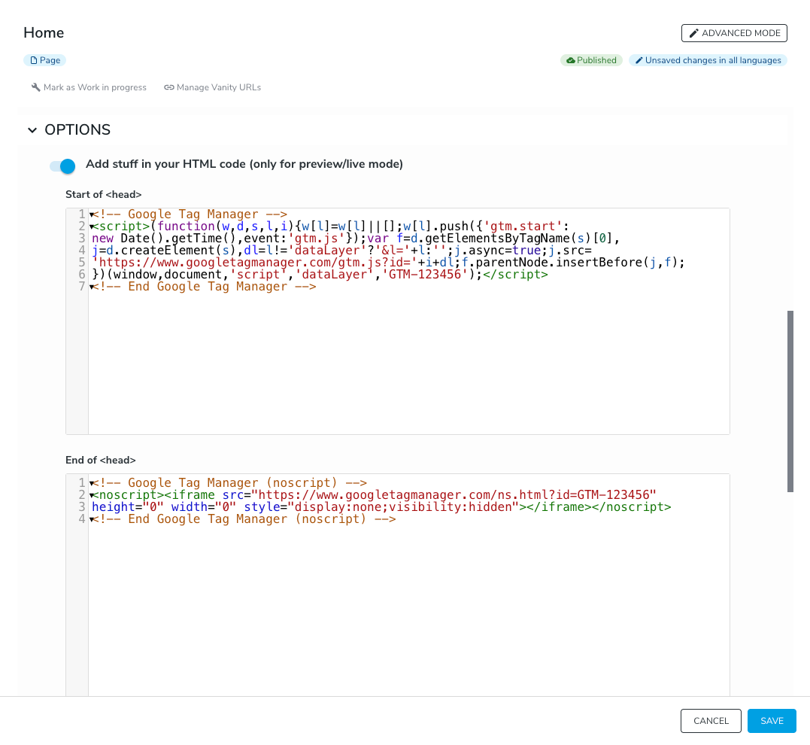
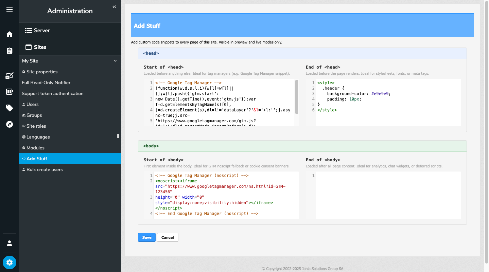

# AddStuff

> Inject custom HTML into any Jahia page — without touching a single template.

[](https://opensource.org/licenses/MIT)
[](https://www.jahia.com)
[](https://github.com/jahia/addStuff/releases/tag/addstuff-3.0.0)

AddStuff is a Jahia module that lets you insert arbitrary HTML (scripts, stylesheets, tracking pixels, consent banners, …) at four precise locations in every rendered page. It works as a render filter: no template change, no redeployment, no developer required.

---

## Table of contents

- [How it works](#how-it-works)
- [For editors — injecting code on a single page](#for-editors--injecting-code-on-a-single-page)
- [For site administrators — injecting code on all pages](#for-site-administrators--injecting-code-on-all-pages)
- [For server administrators](#for-server-administrators)
  - [Requirements & installation](#requirements--installation)
  - [Permission model](#permission-model)
  - [Granting access without Site Administrator rights](#granting-access-without-site-administrator-rights)
  - [Security considerations](#security-considerations)
  - [Multi-site behavior](#multi-site-behavior)
  - [Caching](#caching)
  - [Build from source](#build-from-source)
- [Examples](#examples)
  - [CSS override](#css-override)
  - [Google Fonts](#google-fonts)
  - [Google Tag Manager](#google-tag-manager)
  - [HubSpot tracking](#hubspot-tracking)
  - [Hotjar](#hotjar)
- [Troubleshooting](#troubleshooting)
- [Changelog](#changelog)

---

## How it works

AddStuff injects content at four locations in the HTML output of every page:

```html
<!doctype html>
<html lang="en">
  <head>
    <!-- 1. Start of <head> — right after <head> -->

    <meta charset="utf-8">
    <title>My page</title>
    <link href="…" rel="stylesheet">

    <!-- 2. End of <head> — right before </head> -->
  </head>
  <body>
    <!-- 3. Start of <body> — right after <body> -->

    <h1>Page content</h1>

    <!-- 4. End of <body> — right before </body> -->
  </body>
</html>
```

| Location | Typical use |
|---|---|
| **Start of `<head>`** | Tag managers (e.g. GTM snippet), early analytics |
| **End of `<head>`** | Stylesheets, fonts, meta tags that must load before render |
| **Start of `<body>`** | GTM noscript fallback, cookie consent banners |
| **End of `<body>`** | Analytics, chat widgets, deferred scripts |

> **Note:** Injected code is only visible in **preview** and **live** modes. Nothing appears in edit mode — this is by design, since AddStuff operates as a render filter at page rendering time.

### Injection order

Both scopes (site-wide and page-level) can be active simultaneously. When both are configured for the same injection point, the final HTML output is:

```
[site-level snippet]
[page-level snippet]
```

Site-level content is always injected first; page-level content is appended immediately after at the same location.

---

## For editors — injecting code on a single page

Use this when you need to inject code **on one specific page only** (e.g. a landing page with a specific tracking pixel, or a page that needs a custom stylesheet).

1. Open the page in jContent edit mode.
2. In the top toolbar, open the page properties and go to the **Options** tab.
3. Enable the toggle **Add stuff in your HTML code (only for preview/live mode)**. Four code editors appear — one per injection point.
4. Fill in the relevant fields and click **Save**.



> Page changes require a **publication workflow** to appear in live mode. Use preview mode to verify the result before publishing.

---

## For site administrators — injecting code on all pages

Use this to inject code **across the entire site** (analytics, global stylesheets, consent banners, etc.).

Navigate to **Administration → Sites → [your site] → Add Stuff**. The panel shows four code editors with syntax highlighting — one per injection point:



Fill in the relevant fields and click **Save**. Changes apply **immediately** in preview and live modes — no publication workflow is required.

> **Required permission:** `siteAdminAddStuff`. This is included in the built-in **Site Administrator** role. If you don't have access to this panel, ask your server administrator to grant you the appropriate role (see below).

---

## For server administrators

### Requirements & installation

- **Jahia 8.2** or higher

Install the module from the Jahia Store by following the [module installation tutorial](https://academy.jahia.com/training-kb/tutorials/administrators/installing-a-module).

### Permission model

The module introduces a single permission:

| Permission | Included in | Grants access to |
|---|---|---|
| `siteAdminAddStuff` | Site Administrator role | Add Stuff panel in site administration |

Editors and contributors working directly on pages do **not** need this permission — they access AddStuff through the standard page Options tab, controlled by their existing content editing rights.

### Granting access without Site Administrator rights

If you want a user to manage site-wide snippets without granting them full Site Administrator access, create a dedicated site role:

1. Go to **Server Administration → Roles and Permissions**.
2. Click **Create a new role**, select **Site role**, and give it a name (e.g. *Add Stuff manager*).
3. Add the **Site admin add stuff** permission to the role and save.
4. Go to **Server Administration → Sites → [your site] → Site roles**.
5. Find the role you just created, click **Edit**, assign the desired users or groups, and save.

The users can now access **Administration → Sites → [your site] → Add Stuff** without any other Site Administrator privileges.

> For more background on Jahia site roles, see [How can my editors access the site settings in Jahia 8?](https://academy.jahia.com/how-can-my-editors-access-the-site-settings-in-jahia-8-2)

### Security considerations

> **Important:** AddStuff does **not** sanitize or validate the injected code. Whatever is entered in the fields is rendered verbatim into every page HTML.

- Grant the `siteAdminAddStuff` permission only to **trusted users**. A malicious or erroneous script entered at site level would affect every visitor of every page.
- Page-level access is controlled by standard content editing rights — apply the same care when deciding who can edit page properties.
- Consider using a Content Security Policy (CSP) at the infrastructure level as an additional safeguard.

### Multi-site behavior

Each Jahia site has its own independent AddStuff configuration. Snippets configured for *Site A* have no effect on *Site B*. There is no inheritance between sites.

### Caching

AddStuff operates as a Jahia render filter, applied each time a page is rendered by the Jahia server. It is therefore subject to the same server-side caching rules as the rest of the page.

If a **CDN or reverse proxy** caches the full HTML response upstream of Jahia, changes made in AddStuff may not be immediately visible in live mode until the CDN cache is invalidated. Check your infrastructure's cache TTL and purge policies if you observe a delay.

### Build from source

```bash
git clone git@github.com:jahia/addStuff.git
cd addStuff
mvn clean install
```

The built bundle (`target/addstuff-*.jar`) can then be deployed via the Jahia administration console or placed directly in the `$JAHIA_HOME/modules` directory.

---

## Examples

> The snippets below are provided as a starting point only. Third-party services update their tracking code regularly — always refer to the official documentation of each service for the current and recommended snippet.

### CSS override

To override existing styles on all pages, use the **End of `<head>`** field at site level so your rules load after existing stylesheets:

```html
<style>
.header {
    background-color: #e9e9e9;
    padding: 10px;
}
</style>
```

### Google Fonts

Use the **End of `<head>`** field at site level:

```html
<link rel="preconnect" href="https://fonts.googleapis.com">
<link rel="preconnect" href="https://fonts.gstatic.com" crossorigin>
<link href="https://fonts.googleapis.com/css2?family=Inter:wght@400;600&display=swap" rel="stylesheet">
```

### Google Tag Manager

GTM requires snippets in two locations. At site level, fill in:

**Start of `<head>`:**
```html
<!-- Google Tag Manager -->
<script>(function(w,d,s,l,i){w[l]=w[l]||[];w[l].push({'gtm.start':
new Date().getTime(),event:'gtm.js'});var f=d.getElementsByTagName(s)[0],
j=d.createElement(s),dl=l!='dataLayer'?'&l='+l:'';j.async=true;j.src=
'https://www.googletagmanager.com/gtm.js?id='+i+dl;f.parentNode.insertBefore(j,f);
})(window,document,'script','dataLayer','GTM-XXXXXX');</script>
<!-- End Google Tag Manager -->
```

**Start of `<body>`:**
```html
<!-- Google Tag Manager (noscript) -->
<noscript><iframe src="https://www.googletagmanager.com/ns.html?id=GTM-XXXXXX"
height="0" width="0" style="display:none;visibility:hidden"></iframe></noscript>
<!-- End Google Tag Manager (noscript) -->
```

### HubSpot tracking

Use the **End of `<body>`** field at site level:

```html
<!-- HubSpot Tracking Code -->
<script type="text/javascript" id="hs-script-loader" async defer
  src="//js.hs-scripts.com/XXXXXXXX.js"></script>
```

### Hotjar

Use the **Start of `<head>`** field at site level:

```html
<!-- Hotjar Tracking Code -->
<script>
  (function(h,o,t,j,a,r){
    h.hj=h.hj||function(){(h.hj.q=h.hj.q||[]).push(arguments)};
    h._hjSettings={hjid:XXXXXXX,hjsv:6};
    a=o.getElementsByTagName('head')[0];
    r=o.createElement('script');r.async=1;
    r.src=t+h._hjSettings.hjid+j+h._hjSettings.hjsv;
    a.appendChild(r);
  })(window,document,'https://static.hotjar.com/c/hotjar-','.js?sv=');
</script>
```


---

## Troubleshooting

**My injected code does not appear on the page.**
AddStuff only injects in **preview** and **live** modes. Switch out of edit mode and verify in preview first.

**The Add Stuff panel is not visible in site administration.**
You don't have the `siteAdminAddStuff` permission. Ask your server administrator to assign you the Site Administrator role or a custom role that includes this permission.

**I saved the site-wide snippet but the live site still shows the old version.**
Site-level changes are auto-published — no workflow is needed. If the content still looks outdated, your CDN or reverse proxy may be serving a cached response. Purge the CDN cache for the affected pages or wait for the cache TTL to expire.

**I saved a page-level snippet but the live site does not reflect it.**
Page-level changes go through the standard Jahia publication workflow. Make sure the page has been published after saving.

---

## Changelog

### Jahia 8 branch

| Version | Date | Requires Jahia | Changes |
|---|---|---|---|
| **3.0.0** | 2026-03-20 | 8.2+ | Dedicated site admin panel with CodeMirror editors · CodeMirror in Content Editor for page-level fields · `siteAdminAddStuff` permission · OSGi Declarative Services (removed Spring/Blueprint) · Translations: EN, FR, DE, IT, PT, ES |
| **2.1.1** | 2021-11-16 | 8.0+ | Removed dependency on `templates-system` |
| **2.1.0** | 2021-10-13 | 8.0+ | Page-level injection: editors can configure AddStuff per page via the Options tab |
| **2.0.1** | 2020-05-18 | 8.0+ | Fixed injection when only `addStuffHeadTop` is set · Jahia 8 compatibility |

### Jahia 7 branch (legacy)

| Version | Date | Requires Jahia | Changes |
|---|---|---|---|
| **1.5.1** | 2021-11-16 | 7.1.2+ | Removed dependency on `templates-system` |
| **1.5.0** | 2021-10-13 | 7.1.2+ | Page-level injection: editors can configure AddStuff per page via the Options tab |
| **1.4.0** | 2020-05-18 | 7.1.2+ | Fixed injection when only `addStuffHeadTop` is set |
| **1.3** | 2018-01-24 | 7.1.2+ | Added all four injection points (Start/End of `<head>` and `<body>`) · Fixed render filter priority |
| **1.2** | 2015-03-24 | 7.0+ | Changed default filter priority to 20 |
| **1.1** | 2014-08-18 | 7.0+ | Initial Jahia 7 release |

---

## License

[MIT](https://opensource.org/licenses/MIT) © 2017–2026 [Philippe Vollenweider](https://github.com/pvollenweider)
